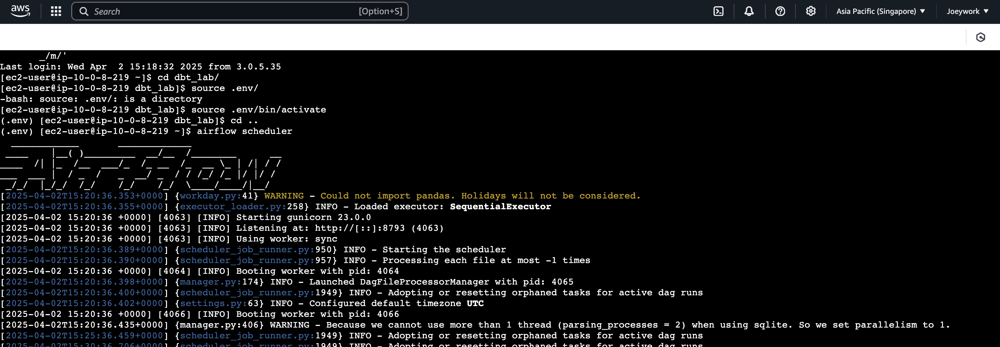
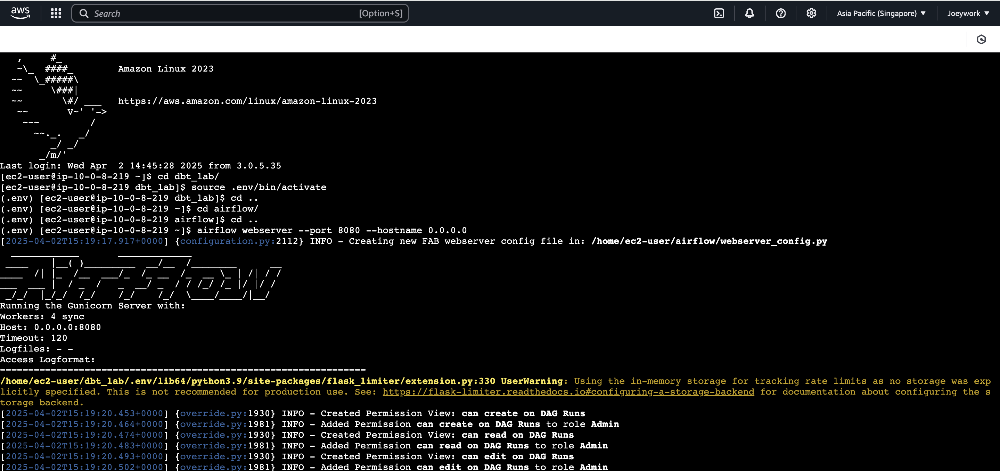
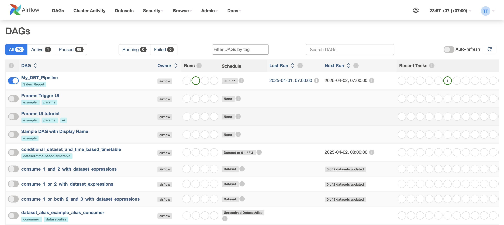

# Setting Up Apache Airflow

This guide walks you through the steps to install and set up Apache Airflow on your machine

## Step 1: Install Airflow
```bash
pip install apache-airflow
 ```

## Step 2: Create a Folder for Airflow
```bash
mkdir airflow
 ```

## Step 3: Initialize the Airflow Database
```bash
airflow db init
 ```

## Step 4: Create an Admin User
```bash
airflow users create \
    --username admin \
    --firstname Thanapoom \
    --lastname Tongplengsri \
    --role Admin \
    --email thanapoom.t@hotmail.com
 ```

## Step 5: Start the Airflow Webserver
```bash
airflow webserver --port 8080 --hostname 0.0.0.0
 ```
 

## Step 6: Start the Airflow Scheduler
Run the scheduler in a separate terminal window to manage your workflows:
```bash
airflow scheduler
 ```
Make sure you run Step 5 and Step 6 in different terminal windows, as they need to run at the same time
 
 
