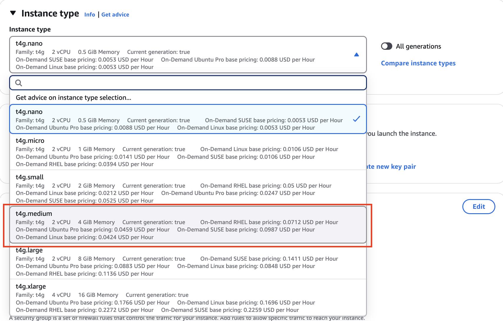

## EC2 Setup for Dbt and Redshift

- Step1 : Launch_instances


- Step2 : Create_name


- Step3 : Instance_type

    -  Note : Select t4g.medium because instance types with only 1-2 GB of RAM are not enough to run the Airflow web server

- Step4 : Create_key_pair

    - Note: The key for accessing the instance should be securely stored. Use .pem for Mac and .ppk for Windows.

- Step5 : Create_vpc

    Note: The VPC must have at least 3 Availability Zones for using Redshift

- Step6 : Setup_Network

    - Note: Enable Auto-assign Public IP for the EC2 instance, as a fixed IP has additional charges
    - Note: Add port 8080 for DBT

- Step7 : Connect_instance
    - click connect
    
    - and connect_instance
    

- Step 8 : Start using the instance server


- Step 9: Setup Python, DBT, and Redshift Environment

    -Use the following command for installation    
    ```bash
    python -m pip install dbt-core dbt-redshift