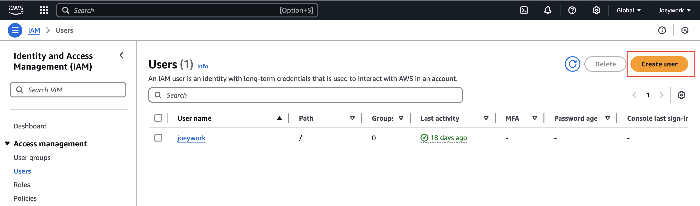
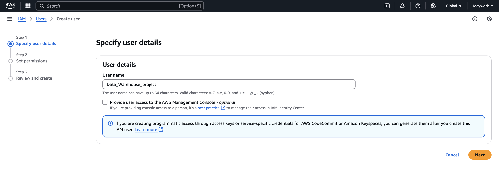
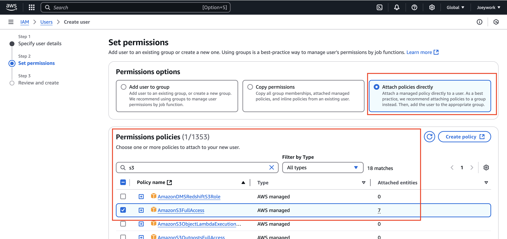
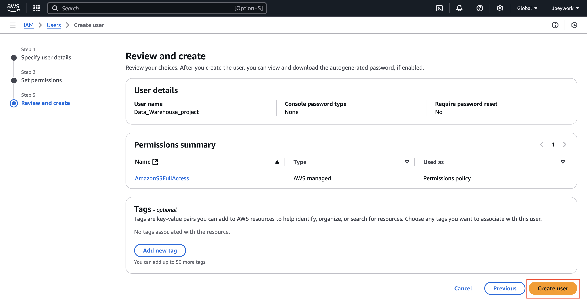
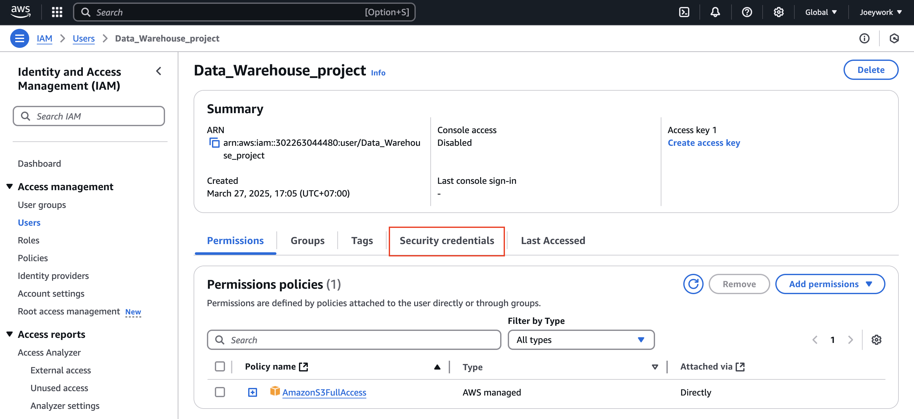
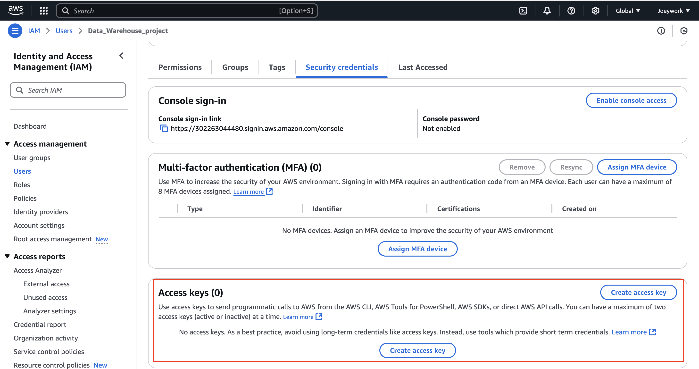
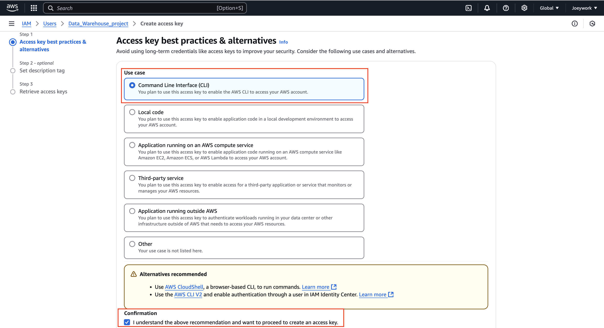
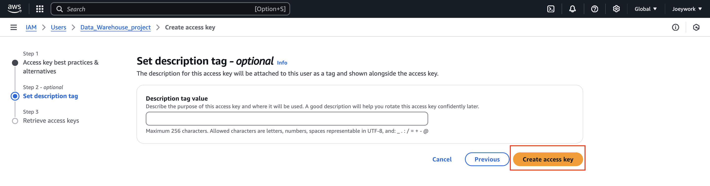

## IAM User Access keys setup

Set up IAM User Access Keys to allow the EC2 instance to interact with S3 via the AWS CLI

### Step1 : Create User

### Step2 : Create Name

### Step3 : Set Permissions

### Step4 : Review

### Step5 : Select Security credencials

### Step6 : Create Access Keys

### Spet7 : Select CLI and Confirmation

### Step8 : Create Access Key

### Step9 : Download Access Key
