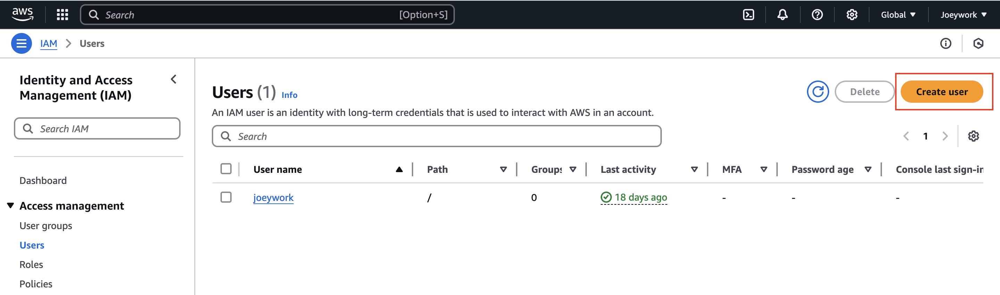
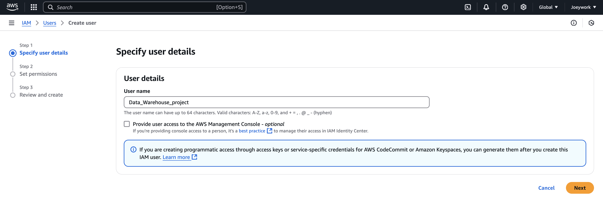
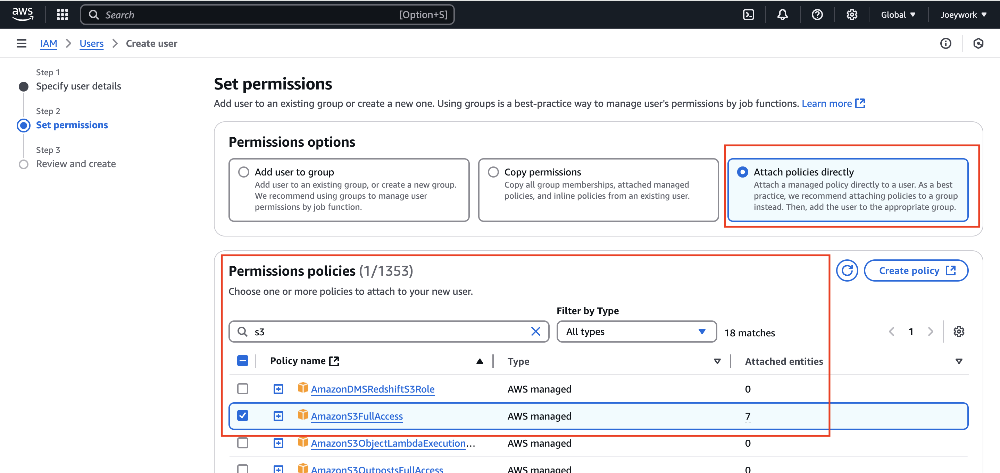
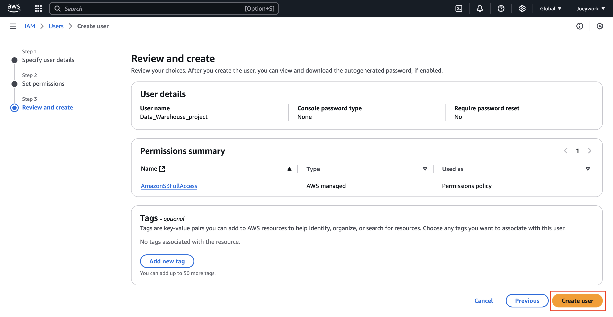
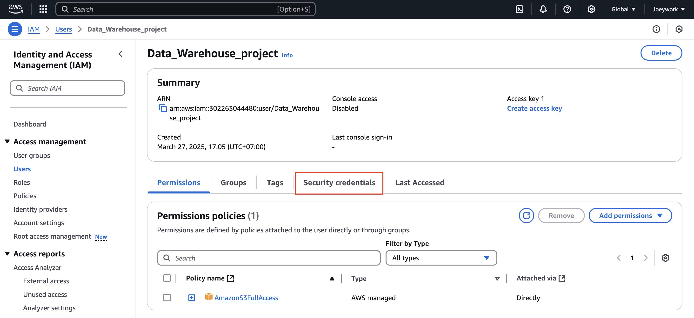
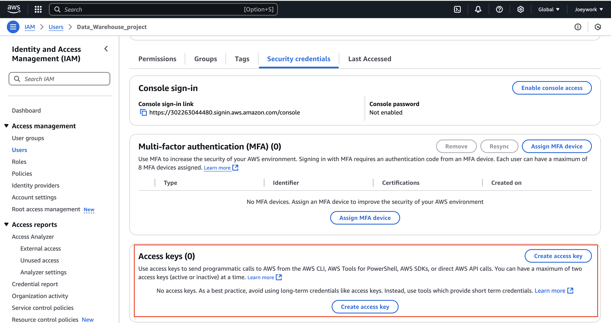
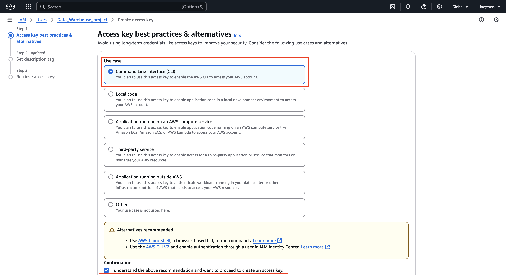
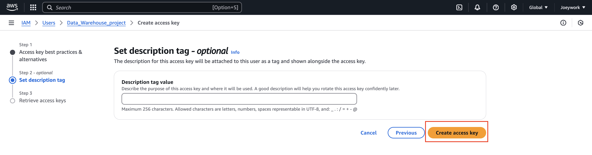
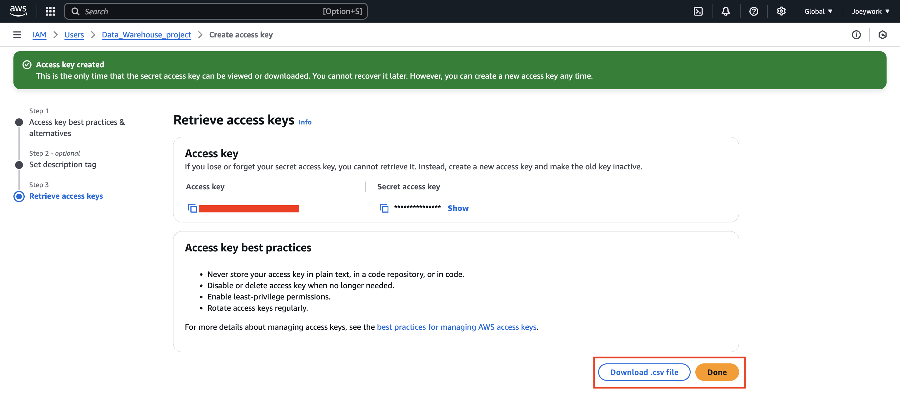

## IAM User Access keys setup

Set up IAM User Access Keys to allow the EC2 instance to interact with S3 via the AWS CLI

- Step1 : Create_User

- Step2 : Create_name

- Step3 : Set_permissions

- Step4 : Review

- Step5 : Select_Security_credencials

- Step6 : Create_Access_keys

- Spet7 : Select_CLI_confirmation

- Step8 : Create_access_key

- Step9 : Download_access_key
