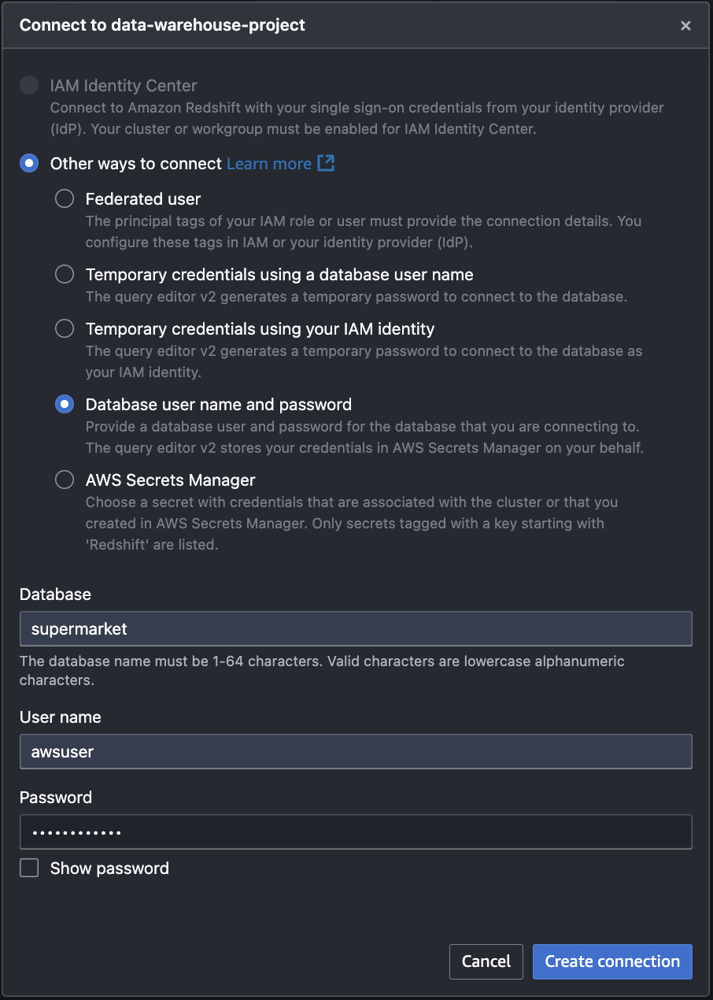

## Redshift Cluster Setup

- Step1 : Create cluster

    - Note: dc2.large is the smallest instance type, and selecting only 1 node is sufficient for small projects

- Step2 : Database configurations

- Step3 : Add permission

- Step4 : Create subnet group

- Step5 : Network security

    - Note: Turn on Publicly Accessible if you are using an instance outside the VPC, such as a local machine
- Step6 : Database name

- Step7 : Check Cluster

- Step8 : Start Redshift Query Editor v2 and Connect to the Database

- Step9 : Creck database
