# AWS Data Warehouse Project

This project builds a data warehouse system on AWS to handle and analyze simulated supermarket sales data. It uses Amazon Redshift as the main database and DBT to transform the data. The goal is to create a fast, flexible, and reliable data pipeline that helps businesses make better decisions by processing sales data efficiently. The system updates automatically every day and displays insights through QuickSight dashboards, making it easy to track sales trends and performance

## Tools and Services
- **DBT**: Handles data transformation and modeling
- **DBT-GreatExpectations**: Adds data validation and quality checks
- **S3**: Cloud storage for raw and processed data
- **Airflow**: Orchestrates ETL workflows
- **AWS EC2**: Provides compute resources for running Airflow and dbt
- **Redshift**: Fully managed data warehouse for storing and querying data
- **IAM**: Manages permissions and security
- **QuickSight**: BI tool for dashboards and visual analytics
- **Languages**:
  - Python: For automation and scripting
  - SQL: For querying and data manipulation
- **Libraries**:
  - Boto3: AWS service interactions in Python

## AWS Data Warehouse Architecture Overview
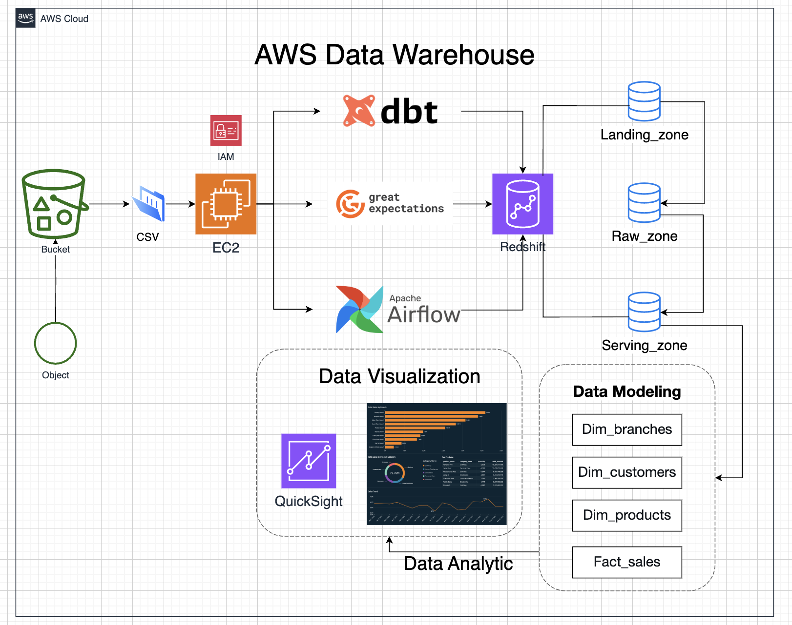

## ER Diagram
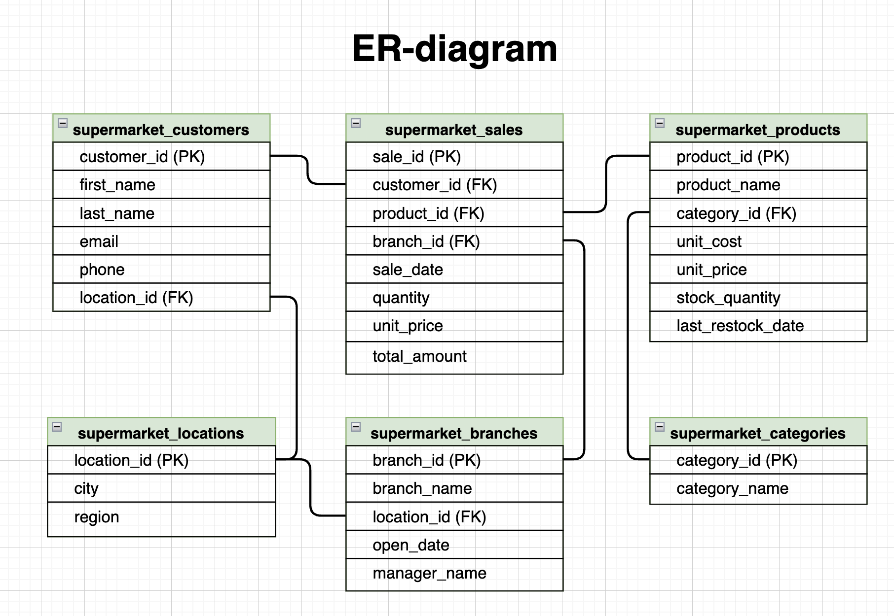

## Setup

- **EC2 Setup** : [AWS-EC2-Setup.md](AWS-EC2-Setup/AWS-EC2-Setup.md)

- **IAM User Access Keys Setup** : [AWS-IAM-User-Access-keys-Setup.md](AWS-IAM-User-Access-keys-Setup/AWS-IAM-User-Access-keys-Setup.md)

- **Redshift Setup** : [AWS-Redshift-Setup.md](AWS-Redshift-Setup/AWS-Redshift-Setup.md)

- **S3 Setup** : [S3_setup.md](import_data_to_s3/S3_setup_images/S3_setup.md)

### Step1 : Setup Environment

Set up the environment to allow the EC2 instance to work with other AWS services, such as S3 , Redshift

1. **Configure AWS CLI**
Run the AWS CLI configuration to set up credentials and access permissions
   
 - Use the Access Key from [AWS-IAM-User-Access-keys-Setup.md](AWS-IAM-User-Access-keys-Setup/AWS-IAM-User-Access-keys-Setup.md)
  

2. **Set Up Python Environment and Install dbt-redshift**
    

3. **Initialize dbt**
   ```bash
    dbt init
    ```
   - Use the Redshift endpoint when setting up dbt
    
     - Note : Use only this part : data-warehouse-project.cn7cimzrfkqf.ap-southeast-1.redshift.amazonaws.com
   - Modify Security Groups to allow EC2 to connect to Redshift : Add an Inbound Rule to allow port 5439 for the private IP of the EC2 instance
   
   - Check the dbt profile configuration in .dbt/profiles.yml
   

### Step 2: DBT Seed for Creating Tables in Redshift

1. **Copy the S3 URI** of your data source  
     

2. **Sync data to the `seeds` folder using AWS S3 Sync**  
   - Navigate to the path:  
     `/home/ec2-user/dbt_lab/dbt_supermarket_project/seeds`  
       
   - Run the following command:  
     ```bash
     aws s3 sync s3://data-warehouse-project-supermarket/data/ .
     ```
     

3. **Run dbt `dbt seed`**
   - Run the following command:  
     ```bash
     dbt seed
     ```
     


4. **DBT automatically creates tables and DDL in Redshift**  
   - **Check Redshift Tables**
   

  
### Step 3: DBT Model - Raw and Serving

- **Navigate to the `models` directory**
    ```bash
     /home/ec2-user/dbt_lab/dbt_supermarket_project/models/supermarket_raw
     ```
     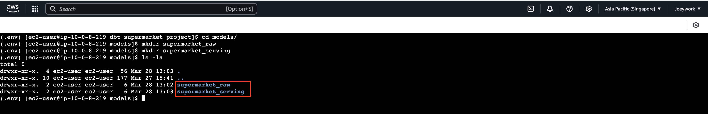
#### Raw Models  
 - Raw models are created from the source data  
 - Inside the `supermarket_raw/` folder, define `.sql` files for raw tables and a `sources.yml` file for source definitions
   - [supermarket_raw_branches.sql](DBT/dbt_models/dbt_raw/supermarket_raw_branches.sql)
   - [supermarket_raw_categories.sql](DBT/dbt_models/dbt_raw/supermarket_raw_categories.sql)
   - [supermarket_raw_customers.sql](DBT/dbt_models/dbt_raw/supermarket_raw_customers.sql)
   - [supermarket_raw_locations.sql](DBT/dbt_models/dbt_raw/supermarket_raw_locations.sql)
   - [supermarket_raw_products.sql](DBT/dbt_models/dbt_raw/supermarket_raw_products.sql)
   - [supermarket_raw_sales.sql](DBT/dbt_models/dbt_raw/supermarket_raw_sales.sql)
   - [sources.yml](DBT/dbt_models/dbt_raw/sources.yml)
 - Example SQL file (`supermarket_raw_branches.sql`):  
   ```sql
    {{
        config(
        materialized = 'table',
        schema = 'raw'
        )
    }}

    select
        *
    from {{ source('supermarket','supermarket_branches') }}
    ```
 - Example sources.yml file:
   ```sql
    version: 2
    sources:
      - name: supermarket
        schema: supermarket
        tables:
        - name: supermarket_branches
        - name: supermarket_categories
        - name: supermarket_customers
        - name: supermarket_locations
        - name: supermarket_products
        - name: supermarket_sales
    ```
 - **Run dbt**  
     Run the following command to build the models:  
     ```bash
     dbt run
     ```
     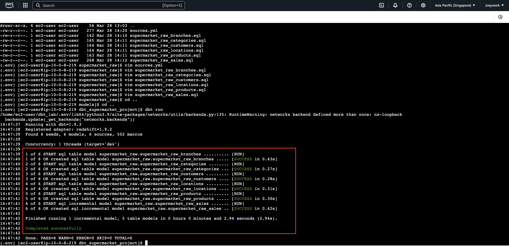
 - **Check Redshift Tables**  
     After running `dbt run`, verify the raw tables created in Redshift 
     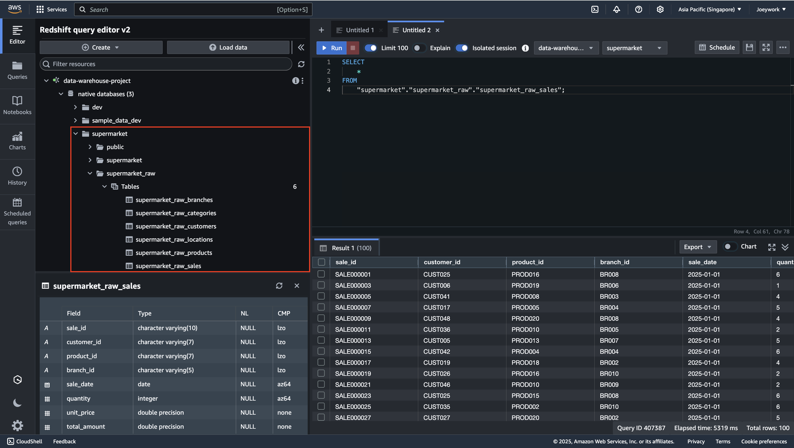
#### **Serving Models**
 - Serving models are transformed models that are ready for use in analytics or reporting. These models aggregate or join raw data to create business-relevant view tables
    ```bash
     /home/ec2-user/dbt_lab/dbt_supermarket_project/models/supermarket_serving
     ```
     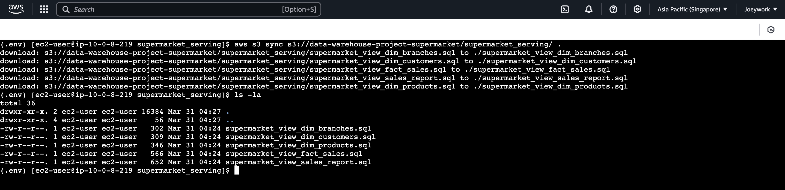

   - [supermarket_view_dim_branches.sql](DBT/dbt_models/dbt_serving/supermarket_view_dim_branches.sql)
   - [supermarket_view_dim_customers.sql](DBT/dbt_models/dbt_serving/supermarket_view_dim_customers.sql)
   - [supermarket_view_dim_products.sql](DBT/dbt_models/dbt_serving/supermarket_view_dim_products.sql)
   - [supermarket_view_fact_sales.sql](DBT/dbt_models/dbt_serving/supermarket_view_fact_sales.sql)
   - [supermarket_view_sales_report.sql](DBT/dbt_models/dbt_serving/supermarket_view_sales_report.sql)

 - **Example: [supermarket_view_fact_sales.sql](DBT/dbt_models/dbt_serving/supermarket_view_fact_sales.sql)**
    ```sql
    {{
        config(
        materialized = 'view',
        schema = 'serving'
        )
    }}
    SELECT
        s.sale_id,
        s.customer_id,
        s.product_id,
        s.branch_id,
        s.sale_date,
        s.quantity,
        p.unit_price,
        s.total_amount,
        p.unit_cost,
        ROUND((p.unit_price - p.unit_cost) * s.quantity,2) AS profit,
        CASE 
            WHEN s.unit_price = 0 THEN 0
            ELSE ROUND(((p.unit_price - p.unit_cost) / p.unit_price) * 100, 2)
        END AS "margin(%)"
    FROM {{ ref('supermarket_raw_sales')}} s
    LEFT JOIN {{ ref('supermarket_raw_products')}} p 
        ON s.product_id = p.product_id
     ```
 - **Sales report for data analytics**  
 - This model is created by joining the fact view table with the dimension view tables
 - [supermarket_view_sales_report.sql](DBT/dbt_models/dbt_serving/supermarket_view_sales_report.sql)
    ```sql
    {{
        config(
        materialized = 'view',
        schema = 'serving'
        )
    }}
    SELECT
        s.sale_id,
        s.customer_id,
        s.product_id,
        s.branch_id,
        s.sale_date,
        s.quantity,
        s.total_amount,
        p.product_name,
        p.category_name,
        p.unit_cost,
        p.unit_price,
        c.first_name,
        c.last_name,
        b.branch_name,
        b.manager_name,
        b.city,
        b.region
    FROM {{ ref('supermarket_view_fact_sales')}} s
    LEFT JOIN {{ ref('supermarket_view_dim_products')}} p ON s.product_id = p.product_id
    LEFT JOIN {{ ref('supermarket_view_dim_customers')}} c ON s.customer_id = c.customer_id
    LEFT JOIN {{ ref('supermarket_view_dim_branches')}} b ON s.branch_id = b.branch_id
     ```
    
 - **Run dbt**  
     Run the following command to build the models:  
     ```bash
     dbt run
     ```   
    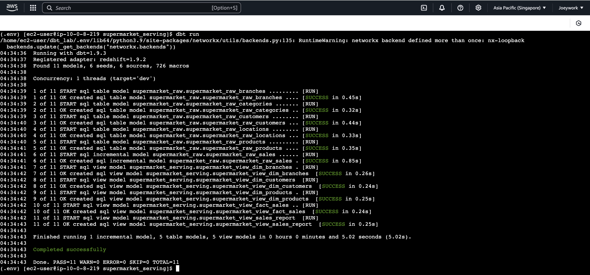

 - **Check Redshift Tables**  
     After running `dbt run`, verify the serving view tables created in Redshift
     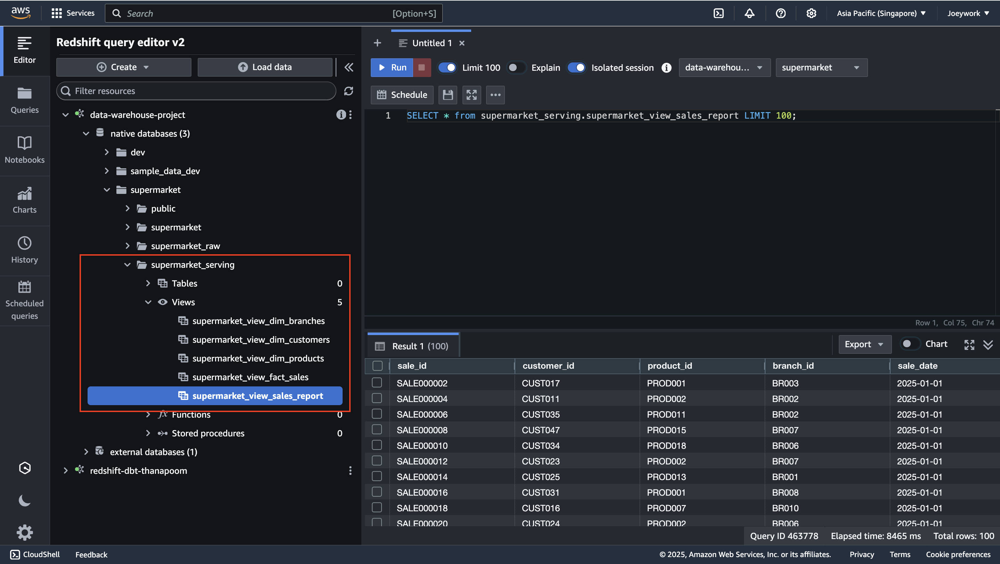

   ### **QuickSight Dashboard Report**
    This dashboard is built using **Amazon QuickSight** and connects to Amazon Redshift to display sales data from the `supermarket_view_sales_report` view in the `supermarket_serving` schema. It focuses on sales insights for **March** and includes the following components:

    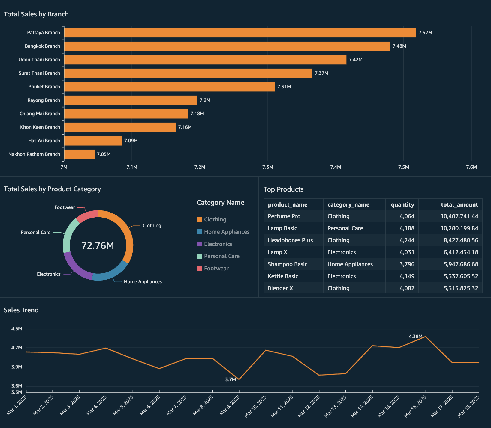

    #### Dashboard Components

    #### 1. Total Sales by Branch
    - Shows the total sales (`sum(total_amount)`) for each `branch_name`
    - Helps compare sales performance across branches

    #### 2. Total Sales by Product Category
    - Displays total sales (`sum(total_amount)`) for each `category_name`
    - Highlights which product categories are performing best

    #### 3. Top Products
    - Lists the top-selling products based on `sum(total_amount)` or `sum(quantity)`

    #### 4. Sales Trend (March)
    - **Visual Type**: Line Chart
    - Shows daily sales trends for the month of March

### Step 4: dbt Web Browser

This section explains how to generate and serve dbt documentation using the dbt web browser interface. The dbt docs feature allows you to visualize your data models and their lineage in a browser

#### 1. Generate dbt Documentation
Run the following command to generate the dbt documentation files:
```bash
dbt docs generate
 ```
#### 2. Serve dbt Documentation
```bash
dbt docs serve --port 8080 --host 0.0.0.0
 ```
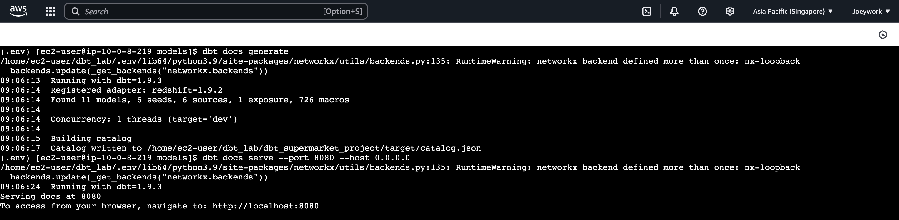
- port 8080: Sets the port to 8080
- host 0.0.0.0: Allows access from external IPs (make sure your Security Group allows traffic on port 8080)
After running the command, open your browser and go to http://your-ec2-public-ip:8080 ( http://47.128.228.216:8080) to see the dbt docs

- dbt Web Browser Detail
Here’s an example of the dbt documentation interface in the browser
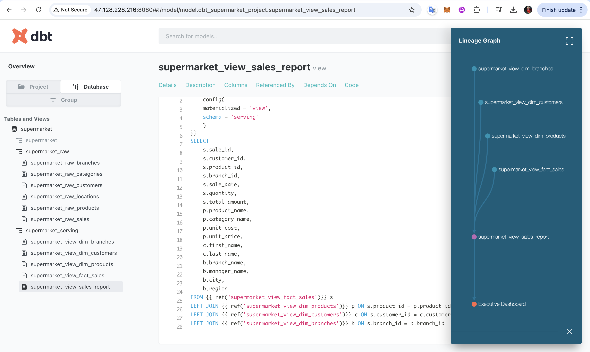
#### 3. dbt Lineage Graph
The dbt docs interface includes a Lineage Graph that shows the relationships between your models, sources, and other nodes in the project
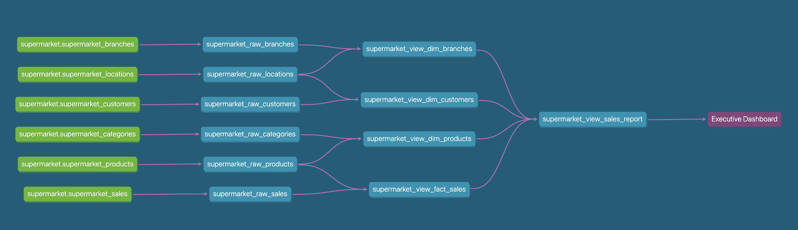

### Step 5: Data Quality with dbt-expectations

In this step, we use dbt-expectations to ensure data quality in our supermarket database. It checks that key columns are not null and unique, verifies specific formats for certain fields, and ensures numeric values and dates fall within reasonable ranges. This helps catch errors and maintain reliable data

- Create the [schema.yml](DBT/dbt_models/dbt_serving/schema.yml) File
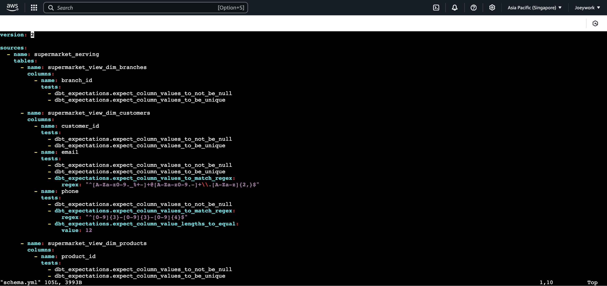
- Run the following command to test the data:
  ```bash
   dbt test
   ```
- Check the Test Results
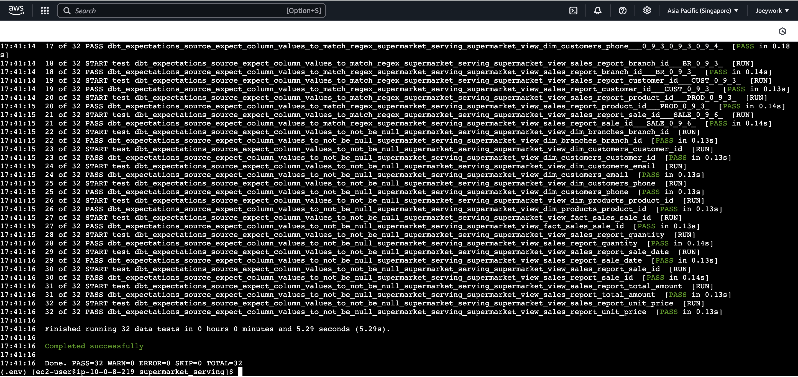

In real projects, we can apply data quality checks at every step for better data reliability

### Step 6: Automate DBT Pipeline with Airflow
This step guides you through setting up and running a DBT pipeline using Apache Airflow

- Complete the Airflow setup from [Airflow_setup.md](AIRFLOW/Airflow_setup.md)

- Create a DAG file at the path `/home/ec2-user/airflow/dags` 
- Use the example file: [supermarket_dbt_dag.py](AIRFLOW/supermarket_dbt_dag.py)
- Example DAG content (runs at 7:00 AM Thailand time):
  ```python
    import pendulum
    from airflow import DAG
    from airflow.operators.bash import BashOperator

    with DAG(
        dag_id="My_DBT_Pipeline",
        #schedule="@daily"
        schedule="0 0 * * *",
        start_date=pendulum.datetime(2025, 1, 1, tz="Asia/Bangkok"),
        catchup=False,
        tags=["Sales_Report"]
    ) as dag:
    
        step_1 = BashOperator(
            task_id="dbt_seed",
            bash_command="/home/ec2-user/dbt_lab/.env/bin/dbt seed --project-dir /home/ec2-user/dbt_lab/dbt_supermarket_project",
        )
        step_2 = BashOperator(
            task_id="dbt_run",
            bash_command="/home/ec2-user/dbt_lab/.env/bin/dbt run --project-dir /home/ec2-user/dbt_lab/dbt_supermarket_project",
        )
        step_3 = BashOperator(
            task_id="dbt_test",
            bash_command="/home/ec2-user/dbt_lab/.env/bin/dbt test --project-dir /home/ec2-user/dbt_lab/dbt_supermarket_project",
            
        )

        step_1 >> step_2 >> step_3
   ```

- Start the Airflow Webserver
  ```bash
  airflow webserver --port 8080 --hostname 0.0.0.0
   ```
  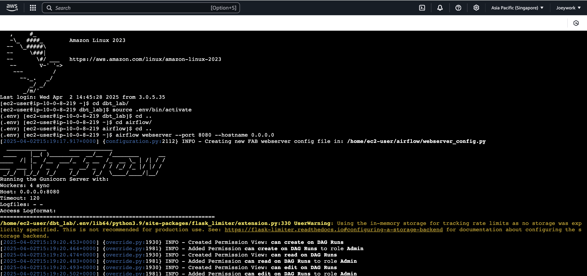

- Start the Airflow Scheduler
- Open a new terminal window and run the scheduler to manage workflows:
   ```bash
   airflow scheduler
    ```
 - Run the webserver (Step 2) and scheduler (Step 3) in different terminal windows at the same time
  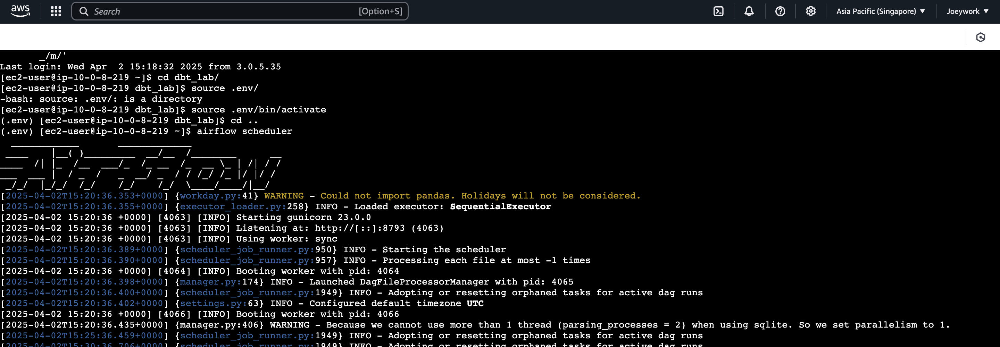

- Access the Airflow Web UI 
- Open your browser and go to: http://your-ec2-public-ip:8080
  

- Run the DAG
  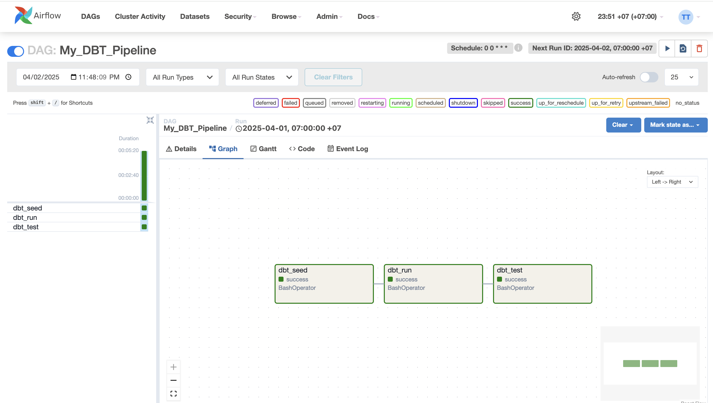

- Check Task Results in Logs
  - DBT Seed Log
  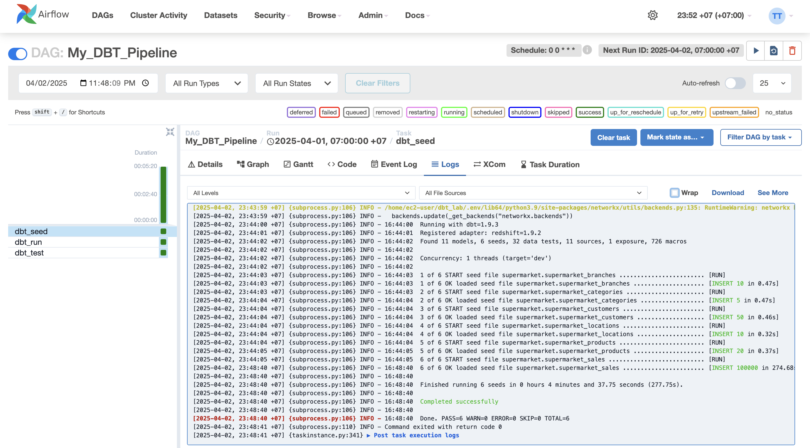
  - DBT Run Log
  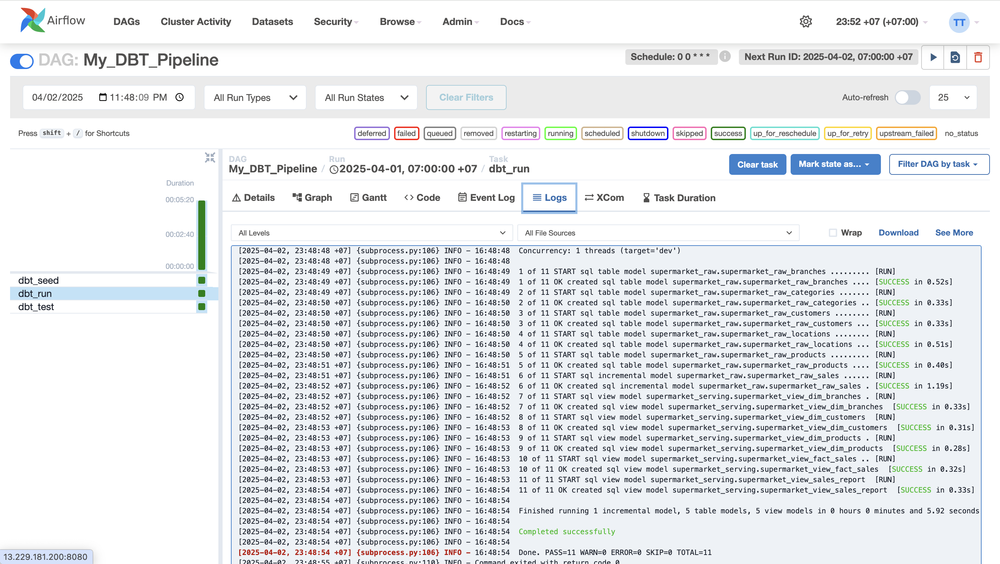
  - DBT Test Log
  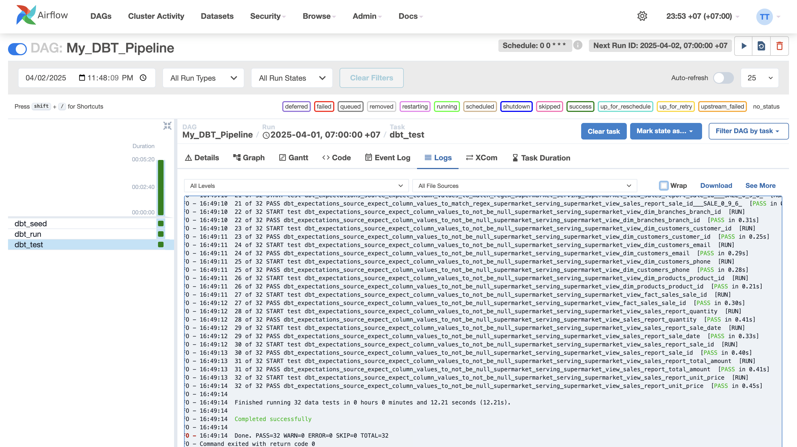

### Step 7: Automate Daily Updates with Airflow
In this step, we use Apache Airflow to automate daily updates for the Redshift data warehouse. A Python script loads new CSV data from S3 into Redshift using the SQL COPY command via Boto3. Then, Airflow runs DBT to update the raw and serving models automatically. This simulates a real-world scenario where new supermarket sales data is uploaded to S3 every day

- Daily S3 File Upload
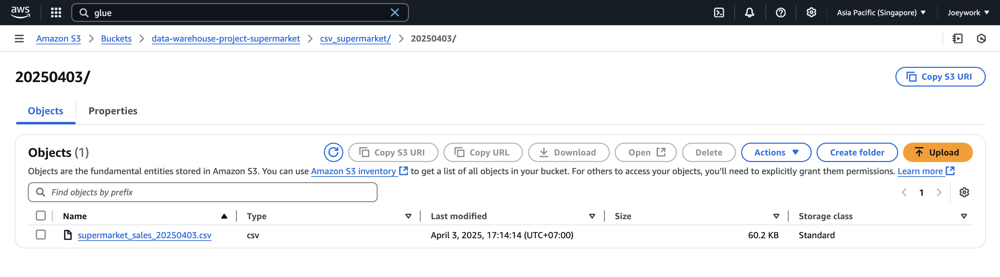
- Add permissions to let the EC2 instance connect to Redshift and read files from S3 using the Python script and Airflow
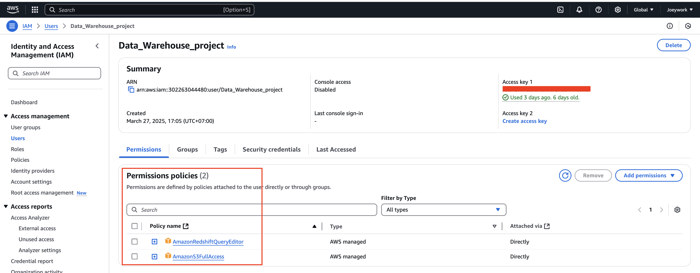

- Create Python Script for Daily Updates
  - File : [daily_supermarket_sales_update.py](DBT/dbt_models/dbt_raw/daily_supermarket_sales_update.py) 
  - Path : `/home/ec2-user/dbt_lab/dbt_supermarket_project/seeds`
  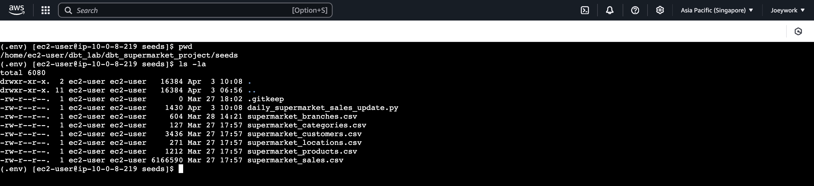
    
    ```bash
    import boto3
    import psycopg2
    from datetime import datetime


    s3_client = boto3.client('s3')

    data_today = datetime.today().strftime('%Y%m%d')

    response = s3_client.list_objects_v2(
        Bucket='data-warehouse-project-supermarket',
        Prefix=f"csv_supermarket/{data_today}/"
    )

    csv_files = [obj['Key'] for obj in response['Contents'] if obj['Key'].lower().endswith('.csv')]

    print("CSV files found:", csv_files)

    redshift_client = boto3.client('redshift')
    response = redshift_client.get_cluster_credentials(
        DbUser='awsuser', 
        DbName='supermarket',
        ClusterIdentifier='data-warehouse-project',
        AutoCreate=False
    )


    redshift_conn = psycopg2.connect(
        dbname='supermarket',
        host='data-warehouse-project.cn7cimzrfkqf.ap-southeast-1.redshift.amazonaws.com',
        port=5439,
        user=response['DbUser'],
        password=response['DbPassword']
    )

    cursor = redshift_conn.cursor()


    iam_role = 'arn:aws:iam::302263044480:role/service-role/AmazonRedshift-CommandsAccessRole-20250224T143611'

    for csv_file in csv_files:
        s3_path = f"s3://data-warehouse-project-supermarket/{csv_file}"
        copy_query = f"""
        COPY supermarket.supermarket_sales
        FROM '{s3_path}'
        IAM_ROLE '{iam_role}'
        CSV
        IGNOREHEADER 1;
        """
        print(f"Loading {csv_file} into Redshift...")
        cursor.execute(copy_query)
        redshift_conn.commit()
        print(f"Loaded {csv_file} successfully")

    cursor.close()
    redshift_conn.close()
     ```

- Create Airflow DAG
  - File : [daily_supermarket_sales_update_dag](AIRFLOW/daily_supermarket_sales_update_dag.py) 
  - Path : `/home/ec2-user/airflow/dags`
  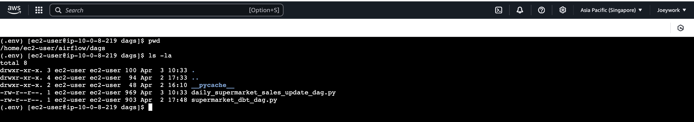
  - Purpose : This DAG runs the Python script to load new data, then updates DBT raw and serving models daily

    ```bash
    import pendulum
    from airflow import DAG
    from airflow.operators.bash import BashOperator

    with DAG(
        dag_id="daily_supermarket_sales_update",
        #schedule="@daily"
        schedule="0 0 * * *",
        start_date=pendulum.datetime(2025, 1, 1, tz="Asia/Bangkok"),
        catchup=False,
        tags=["daily_supermarket_sales_update"]
    ) as dag:
        
        step_1 = BashOperator(
            task_id="run_daily_supermarket_sales_update",
            bash_command="/home/ec2-user/dbt_lab/.env/bin/python /home/ec2-user/dbt_lab/dbt_supermarket_project/seeds/daily_supermarket_sales_update.py",
        )
        step_2 = BashOperator(
            task_id="dbt_run",
            bash_command="/home/ec2-user/dbt_lab/.env/bin/dbt run --project-dir /home/ec2-user/dbt_lab/dbt_supermarket_project",
        )
        step_3 = BashOperator(
            task_id="dbt_test",
            bash_command="/home/ec2-user/dbt_lab/.env/bin/dbt test --project-dir /home/ec2-user/dbt_lab/dbt_supermarket_project",
            
        )

        step_1 >> step_2 >> step_3
     ```

- Run the DAG
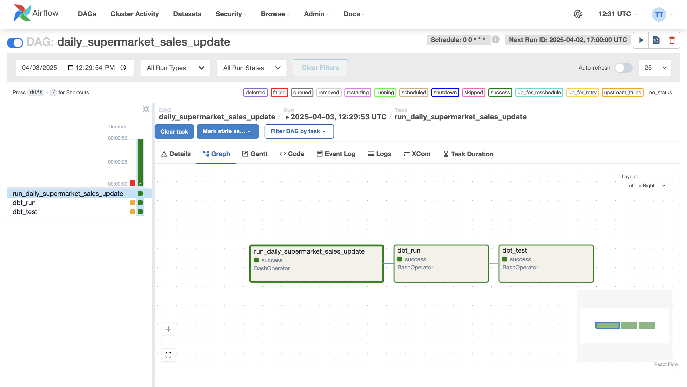

- Before Update : Data in Redshift before adding new daily CSV
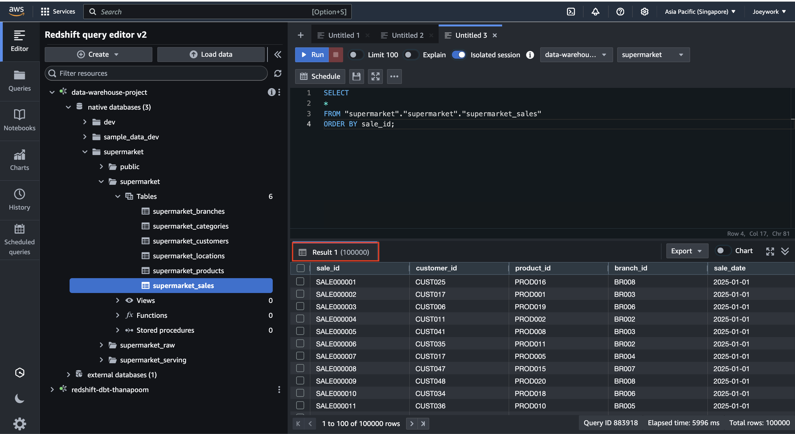

- After Update: Data in Redshift after loading new CSV, with the serving model `supermarket_view_sales_report` updated automatically
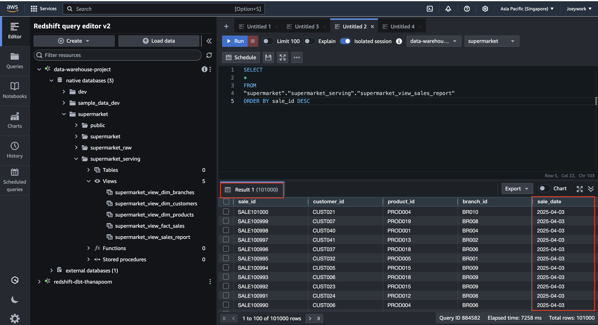

- Incremental Loading Note
This setup ensures `incremental` updates by loading only new CSV files from S3 each day, avoiding full reloads of old data. The `COPY` command appends new rows to the existing Redshift table, and DBT updates the models based on this appended data

### Final Takeaway

This project demonstrates how to build an efficient, automated data warehouse on AWS using Redshift, DBT, and Airflow. By integrating S3 for storage, dbt for data transformation, and QuickSight for visualization, businesses can gain valuable insights from their sales data. The use of dbt-expectations ensures data quality, while the dbt web interface provides clear documentation and model lineage. With this setup, organizations can streamline their data workflows, improve decision-making, and scale analytics with ease


    


