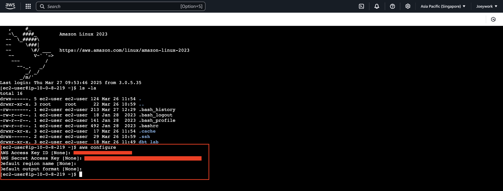
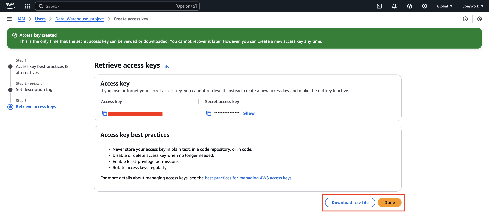
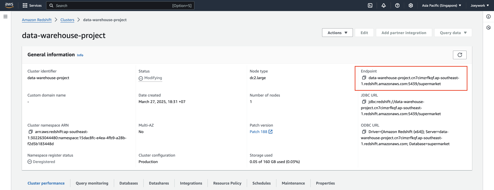
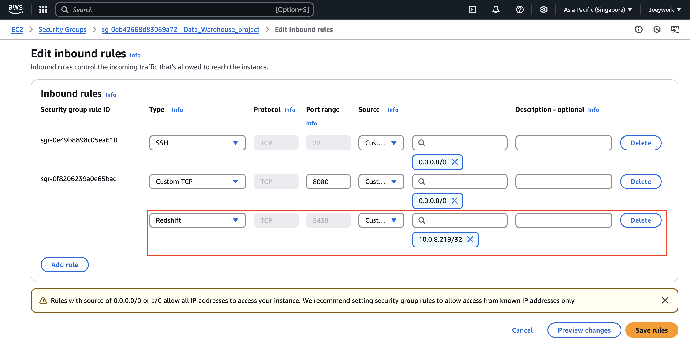
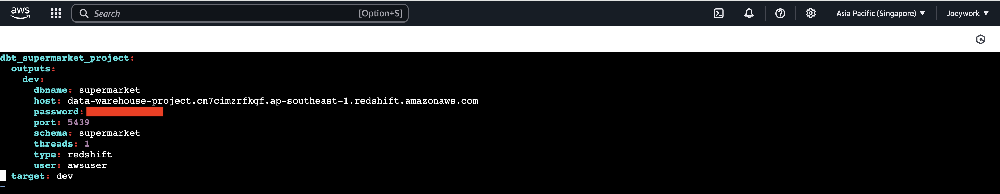
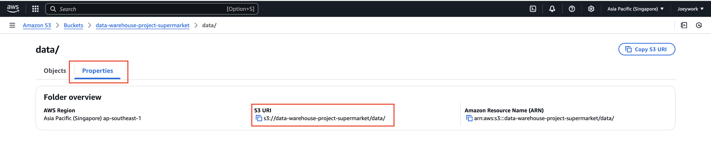
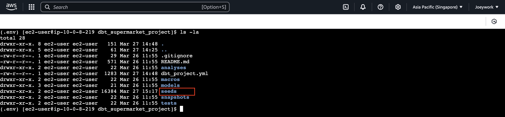
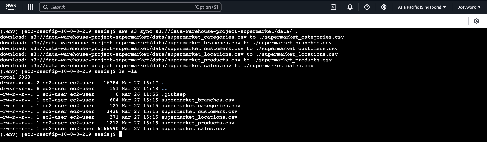
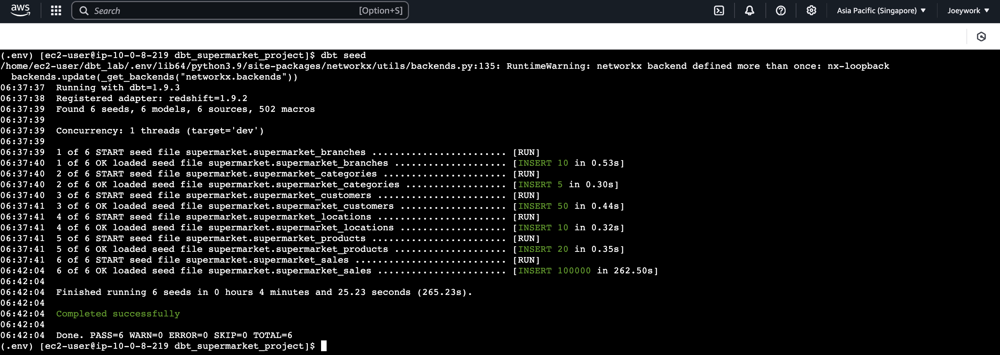
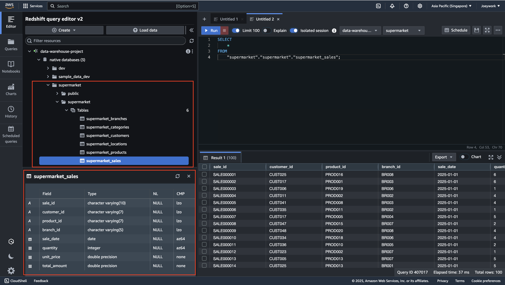

# AWS Data Warehouse Project

This project sets up a data warehouse system on the AWS cloud using simulated supermarket data. The primary database is Amazon Redshift, and DBT is used for data transformation and management. The goal is to create an efficient, scalable, and manageable data pipeline for processing and analyzing supermarket data

## Tools and Services
- **DBT**: Handles data transformation and modeling within the warehouse
- **DBT-GreatExpectations**: Integrates data quality checks and validation with DBT
- **Airflow**: Manages and schedules the ETL workflows
- **AWS EC2**: Provides compute resources to run Airflow and other processes
- **Redshift**: A fully managed data warehouse service for storing and querying data
- **IAM**: Manages permissions and access control for AWS resources
- **QuickSight**: A BI tool for visualizing data and generating reports

## Setup

- **EC2 Setup** : [AWS-EC2-Setup.md](AWS-EC2-Setup/AWS-EC2-Setup.md)

- **IAM User Access Keys Setup** : [AWS-IAM-User-Access-keys-Setup.md](AWS-IAM-User-Access-keys-Setup/AWS-IAM-User-Access-keys-Setup.md)

- **Redshift Setup** : [AWS-Redshift-Setup.md](AWS-Redshift-Setup/AWS-Redshift-Setup.md)

- **S3 Setup** : [S3_setup.md](import_data_to_s3/S3_setup_images/S3_setup.md)

### Step1 : Setup Environment

Set up the environment to allow the EC2 instance to work with other AWS services, such as S3 , Redshift

1. **Configure AWS CLI**
Run the AWS CLI configuration to set up credentials and access permissions
   
    - Use the Access Key from [AWS-IAM-User-Access-keys-Setup.md](AWS-IAM-User-Access-keys-Setup/AWS-IAM-User-Access-keys-Setup.md)
    

2. **Set Up Python Environment and Install dbt-redshift**
    

3. **Initialize dbt**
    - ```bash 
        dbt init
    - Use the Redshift endpoint when setting up dbt
    
        - Note : Use only this part : data-warehouse-project.cn7cimzrfkqf.ap-southeast-1.redshift.amazonaws.com
    - Modify Security Groups to allow EC2 to connect to Redshift : Add an Inbound Rule to allow port 5439 for the private IP of the EC2 instance
    
    - Check the dbt profile configuration in .dbt/profiles.yml
    

### Step 2: DBT Seed for Creating Tables in Redshift

1. **Copy the S3 URI** of your data source  
     

2. **Sync data to the `seeds` folder using AWS S3 Sync**  
   - Navigate to the path:  
     `/home/ec2-user/dbt_lab/dbt_supermarket_project/seeds`  
       
   - Run the following command:  
     ```bash
     aws s3 sync s3://data-warehouse-project-supermarket/data/ .
     ```
     

3. **Run dbt `dbt seed`**
   - Run the following command:  
     ```bash
     dbt seed
     ```
     


3. **DBT automatically creates tables and DDL in Redshift**  
   

  
### Step 3: 


    


